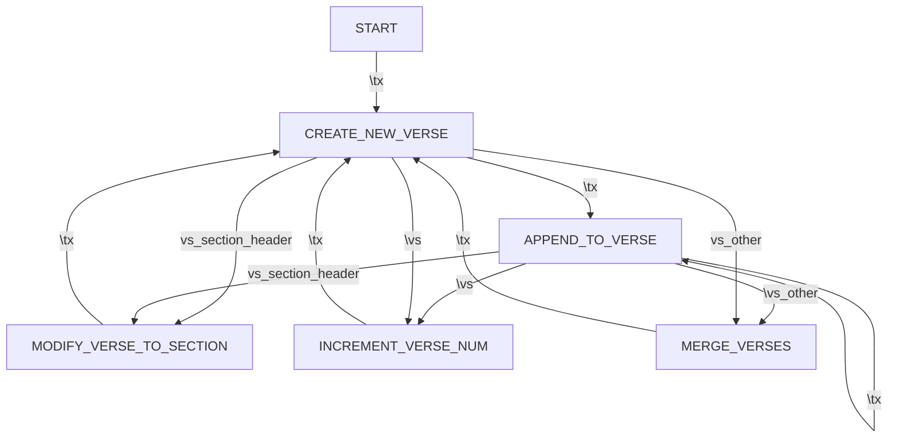

# Design for Parsing Toolbox Text Files

There are two modes for parsing the .txt files in [toolbox.ts](../src/toolbox.ts) into a JSON Object based on how the `\tx` and `\vs` markers are used in the file.
The regex splits each line into `marker` and `content`:
* `TX_AS_VERSE`: Each `\tx` marker creates a new verse, `\vs` only used as `\vs (section title)`.
                 Also treats `\tx title....` as `\vs (section title)`.
* `VS_AS_VERSE`: `\vs` marks verse numbers along with section headers. Uses the state machine below:

```typescript
/**
 * States for VS_AS_VERSE processing mode
 */
type actionType =
  "START" |                   // Initial state
  "CREATE_NEW_VERSE" |        // Create new verse entry and push to content[]
  "APPEND_TO_VERSE" |         // Append current content to last verse
  "INCREMENT_VERSE_NUM" |     // Increment verseNum (current verse counter)
  "MODIFY_VERSE_TO_SECTION" | // Change last type from verse to section section
  "MERGE_VERSES";             // Merge the last two verses, set number = verseNum - 1
                              // This handles \vs 13b, \vs 13c, etc.
```

If the marker is `\vs`, theres 3 additional booleans to determine special cases:
* `vs_verse_bridge` - The `vs` marks a verse bridge (x-y) or [x-y]. This does special handling for verseNum (current verse counter)
* `vs_other` - The `\vs` marks a verse #-other letter besides "a"
* `vs_section_header` - The `\vs` marks a section header (section title)
    Variations of section header include:
    ```
    \vs (section heading)
    \vs (section title)
    \vs section title
     ```

## State machine of the actions and markers
